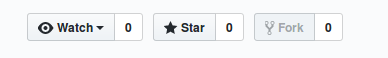
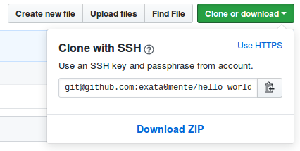
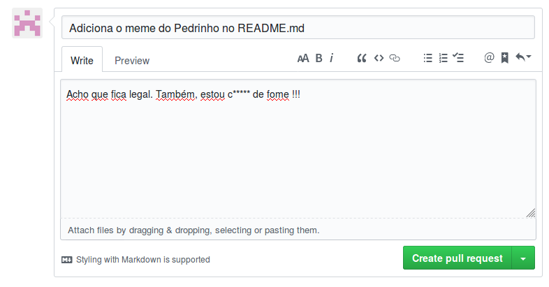

# Exata0mente

## Somos um site colaborativo!

Sim, este site é colaborativo. Nossa idéia é criar um ambiente onde todos possam aprender na prática, contribuir com temas, criar postagens, divulgar idéias ou até registrar notas de aulas.

Você pode fazer uma centena de coisas, vou listar algumas:

* Praticar HTML, CSS, FrontMatter, Liquid Template, entre outros.
* Praticar Git, GitHub, conceitos de trabalho colaborativos.
* Criar conteúdos, divulgar seu canal.
* [Resoluções de exercícios](https://github.com/exata0mente/ResolucoesLivros)
* Resoluções de Problemas ([issues](https://github.com/exata0mente/exata0mente.github.io/issues), por exemplo).
* Conhecer pessoas dispostas a trabalharem colaborativamente.
* [Divulgar](https://exata0mente.com.br/projetos/) seus projetos.
* [Conhecer](https://exata0mente.com.br/projetos/) projetos para colaborar.
* Divulgar pesquisas (tipo *form*) para trabalhos de conclusão de curso.

Dá uma olhada lá no site, tem muita coisa que pode ser feita:

https://exata0mente.com.br/

Este site é estático e foi gerado utilizando [Jekyll](https://jekyllrb.com/), que deixa muito fácil a criação de sites estáticos. O tema utilizado foi o [minimal](https://pages-themes.github.io/minimal/), que era a opção mais rápida a ser utilizada.

Agora veremos como você pode montar o site diretamente em seu ambiente.

## Criando um parquinho

Para que este site possa ser executado localmente, facilitando a visualização das alterações, é necessário ter instalado algumas soluções. Como utilizamos o Jekyll, será necessário então:

* Jekyll
* Ruby

A [documentação](https://jekyllrb.com/) do Jekyll é suficiente para que você consiga instalar estas dependências.

Qualquer problema é só abrir uma issue.

## Brincando no parquinho

Bom, com o ambiente preparado localmente, será necessário trazer o repositório para sua máquina. Temos uma postagem sobre [como trabalhar colaborativamente utilizando o GitHub](https://exata0mente.com.br/resp/como-trabalhar-colaborativamente-utilizando-o-github) caso queira um pouco mais de contexto.

Vamos ao necessário então:

Dê um fork em nosso repositório:



Depois clone-o:

Copie o link que aparece ao clicar no botão *Clone or Dowload*



E então copie todo o conteúdo para seu computador

```shell
git clone git@github.com:SEU_USUARIO/exata0mente.github.io.git
```

Dentro da pasta criada, verifique se todas as dependências estão instaladas com o comando abaixo

```shell
bundle
```
**Importante**
Crie uma branch com o nome do que você irá trabalhar

```shell
git checkout -b altera-tema
```

E em seguida suba o servidor localmente

```shell
bundle exec jekyll serve
```

Agora todas as alterações que você fizer poderão ser verificadas no endereço localhost:4000.

## Fiz algo legal e agora?

Agora é só mandar um pull request

Primeiramente envie suas alterações para o repositório remoto

```shell
git push origin altera-tema
```

E em seguida envie uma pull request

No seu repositório clique no botão *New pull request*


E descreva as alterações que realizou.

.

Agora é só aguardar a validação dos colaboradores e ver sua obra disponível para centenas (tomara) de usuários.

## Localização dos brinquedos

```
.
├── assets
│   └── manual
├── blog
│   └── tag
├── _data
├── docs
├── _drafts
├── _includes
├── _layouts
├── _posts
│   ├── aprenda_mineracao_de_dados
│   ├── arquitetura_de_sistemas_operacionais
│   ├── estatistica_facil
│   ├── manuais
│   ├── projeto_de_banco_de_dados
│   └── treinamento_em_linguagem_c
└── _sass
```
É, nosso parquinho não está muito organizado, inclusive tenho até uma [issue](https://github.com/exata0mente/exata0mente.github.io/issues/12) aberta para isso.

O desafio é organizar os posts sabendo que teremos posts sobre resolução de exercícios, séries de postagens, manuais, divulgação de pesquisas, notas de aulas, e coisas que nem imaginamos ainda.

## O que temos mais?

Se quiser entrar de vez na brincadeira, temos pontos que precisamos de ajuda. Por exemplo:

**Canal no YouTube**

Temos um [canal](https://www.youtube.com/channel/UCfm5J7qGMBgupvKddelZSSA) com um bom índice nas pesquisas do google e acessos diariamente e alguns inscritos que pode ser continuado por alguém que faça vídeos, edite ou simplesmente queira ajudar. Mande-nos um e-mail para conversamos sobre as possibilidades do canal.

**Chatbot**

Temos um [chatbot](m.me/exata0mente) no Facebook, construído com o [Watson Assistant](https://www.ibm.com/cloud/watson-assistant/) que pode abrir vários leques para nossa comunidade. A ideia é automatizarmos as consultas do chatbot ao repositório no GitHub utilizando API.

**Conteúdos Específicos**

Em nosso repositório temos vários exercícios respondidos mas nenhum conteúdo voltado a explicação. Por exemplo, um [exercício](https://exata0mente.com.br/resp/treinamento_em_linguagem_c/cap2/tecl-capitulo-2-exercicio-17.html)em C que solicita o uso de um operador ternário mas não temos um conteúdo que explique o que é o operador ternário.

## Contribuindo então

Dá uma olhadinha no nosso [CONTRIBUTING.md](docs/CONTRIBUTING.md) e ajude a melhorá-lo.

## Licensa

Por último e não menos importante, os termos de uso, distribuição e etc são regidos pela licença [MIT](LICENSE)
